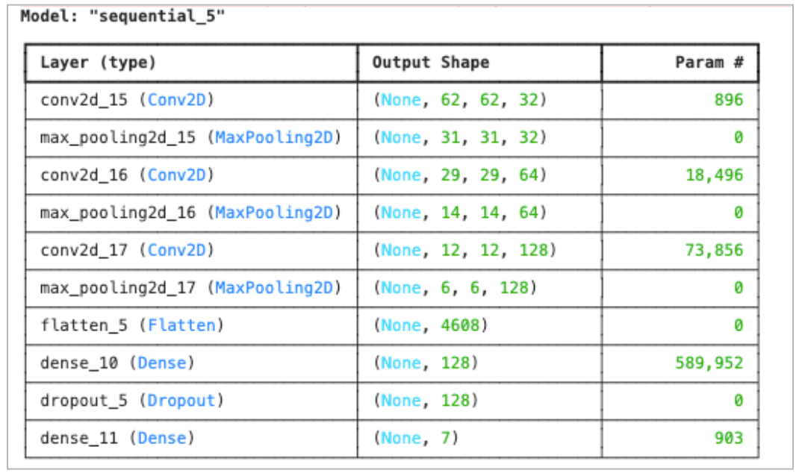
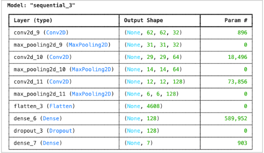
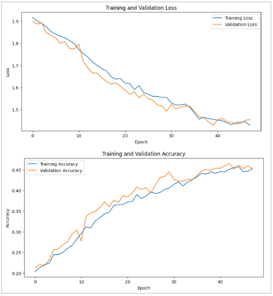

# Custom CNN Models for Facial Emotion Recognition

## Overview
This project implements and compares **five custom Convolutional Neural Network (CNN) models** to classify facial emotions using the FER2013 dataset.  
Each model has different architectural designs and complexities to evaluate their performance and efficiency for emotion recognition tasks.

The models developed are:
- **VisageNet**
- **EmotiNet**
- **MoodCNN**
- **NeuroMood**
- **FERLight**

All models are built using TensorFlow/Keras frameworks.

## Dataset: FER2013
- **Source**: [Kaggle FER2013](https://www.kaggle.com/datasets/msambare/fer2013)
- **Description**:
  - 48x48 grayscale facial images.
  - Labeled with one of 7 emotions:
    - 0 = Angry
    - 1 = Disgust
    - 2 = Fear
    - 3 = Happy
    - 4 = Sad
    - 5 = Surprise
    - 6 = Neutral
- **Dataset Split**: Training, Validation, and Test sets.

# Model Details

## Model 1: VisageNet
- **File**: `VisageNet_model.ipynb`

### Architecture
- Sequential CNN layers with batch normalization after convolutions.
- Aggressive downsampling through pooling.
- Smaller dense layers compared to NeuroMood.
- Higher dropout rates.

### Highlights
- Faster convergence thanks to batch normalization.
- Lighter and faster than NeuroMood.
- Good balance between performance and efficiency.

### 📸 Model Architecture Summary  

### 📈 Training Accuracy and Loss Curves  

### 🔥 Confusion Matrix  

## Model 2: EmotiNet
- **File**: `EmotiNet_model.ipynb`

### Architecture
- CNN layers with smaller kernel sizes.
- GlobalAveragePooling2D instead of Flatten to reduce parameter count.
- Compact dense layers.
- Final softmax classification.

### Highlights
- Most lightweight model among the three.
- Suitable for mobile or embedded applications.
- Quick training and low memory footprint.

### 📈 Training Accuracy and Loss Curves  

### 🔥 Confusion Matrix  

## Model 3: MoodCNN
- **File**: `MoodCNN_model.ipynb`

### Architecture
- Fewer convolutional layers but deeper filters.
- Uses both MaxPooling and AveragePooling.
- Introduces early dropout in convolution blocks.
- Larger dense layers for final prediction.

### Highlights
- Balances depth and width of the network.
- Early dropout helps in regularization during convolution stages.
- Designed to perform well without being overly deep.

### 📸 Model Architecture Summary  

### 📈 Training Accuracy and Loss Curves  

### 🔥 Confusion Matrix  

## Model 4: NeuroMood
- **File**: `NeuroMood_model.ipynb`

### Architecture
- Multiple convolutional layers with increasing filter sizes.
- Max pooling after each convolution block.
- Dropout layers for regularization.
- Fully connected dense layers.
- Final softmax activation for classification.

### Highlights
- Deeper network structure.
- Strong feature extraction focus.
- Regularized for better generalization.

### 📸 Model Architecture Summary  

### 📈 Training Accuracy and Loss Curves  

### 🔥 Confusion Matrix  

## Model 5: FERLight
- **File**: `FERLight_model.ipynb`

### Architecture
- Very shallow CNN model with minimal parameters.
- Small convolutional blocks with aggressive pooling.
- Direct use of GlobalAveragePooling2D for flattening.
- Lightweight dense layers.

### Highlights
- Smallest and fastest among all models.
- Prioritizes efficiency and fast inference time.
- Best suited for low-resource environments like web apps or mobile devices.

### 📸 Model Architecture Summary  

### 📈 Training Accuracy and Loss Curves  

### 🔥 Confusion Matrix  

# Common Training Details
- **Loss Function**: Categorical Crossentropy
- **Optimizer**: Adam
- **Metrics**: Accuracy
- **Input Shape**: (48, 48, 1) — grayscale images

# Conclusion
This project explores and contrasts multiple CNN architectures for facial emotion recognition using the FER2013 dataset. Each model targets specific needs:

| Model      | Focus                         |
|------------|-------------------------------|
| NeuroMood  | Deep feature extraction and high accuracy |
| VisageNet  | Balanced speed and performance |
| EmotiNet   | Lightweight and fast |
| MoodCNN    | Balanced architecture with early regularization |
| FERLight   | Minimalist design for fastest performance |

Comparative performance (accuracy, training speed, confusion matrices) helps users choose the best model depending on requirements like accuracy, speed, or deployment constraints.
